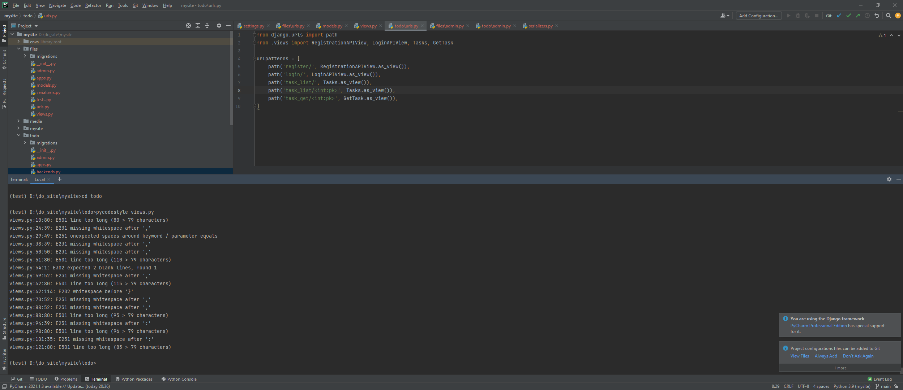
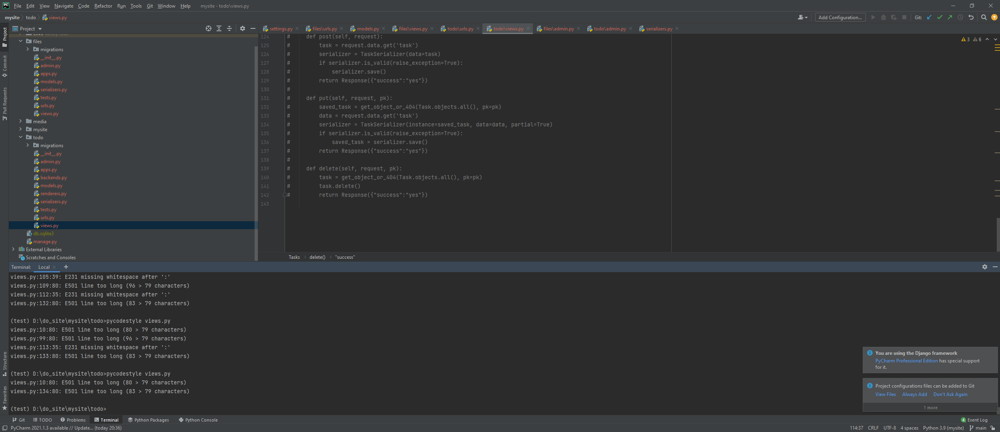
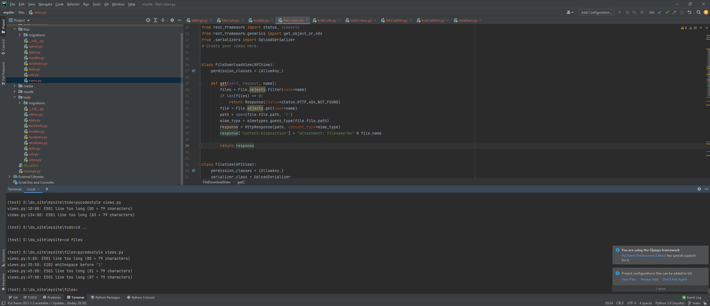
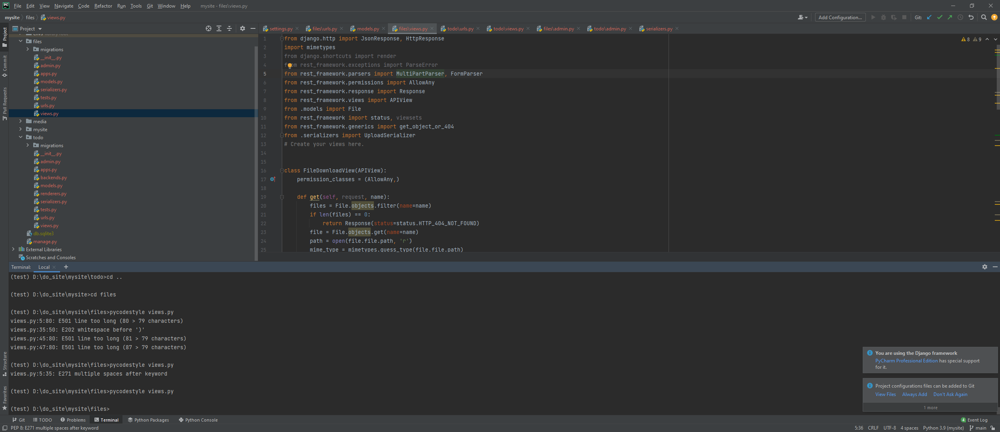
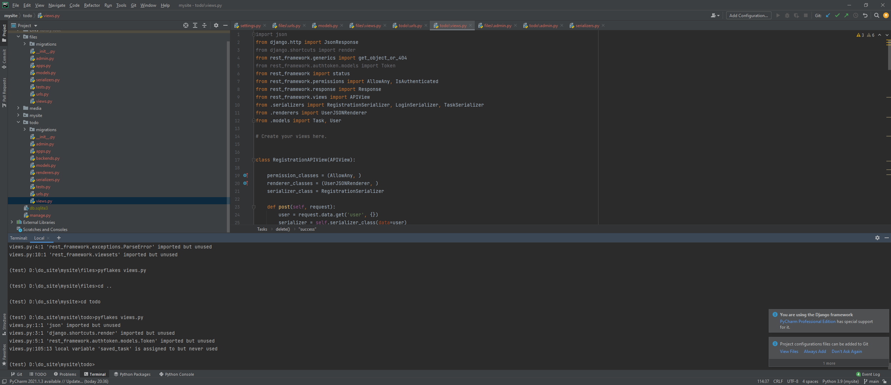
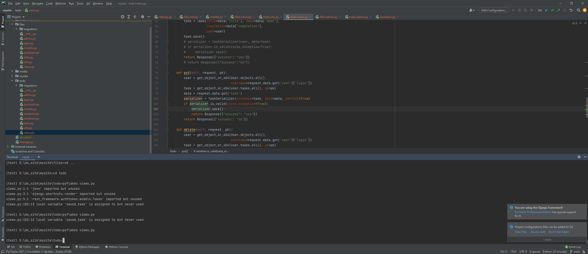
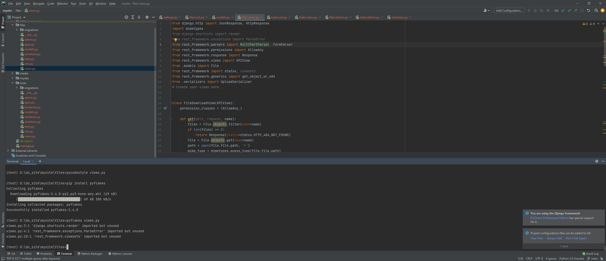
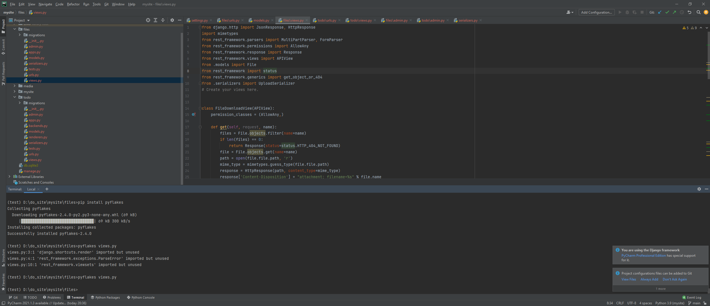

# Задание 5:
Цель: Использование Case-инструментов для улучшения качества ПО.

Pycodestyle:

Todo/views.py:

 
 
Фикс:
 
 
 
Files/views.py:

 
Фикс:

 

Pyflakes:

Todo/views.py:

 
Фикс:

 
Files/views.py:

 
 
Фикс:

